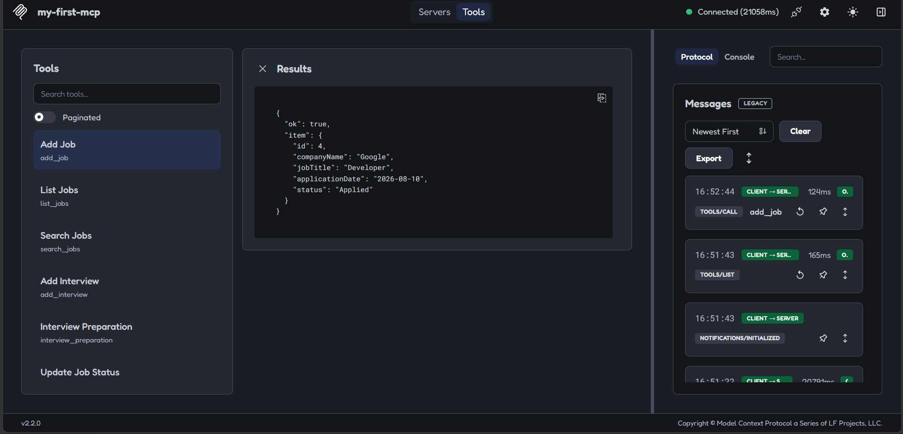
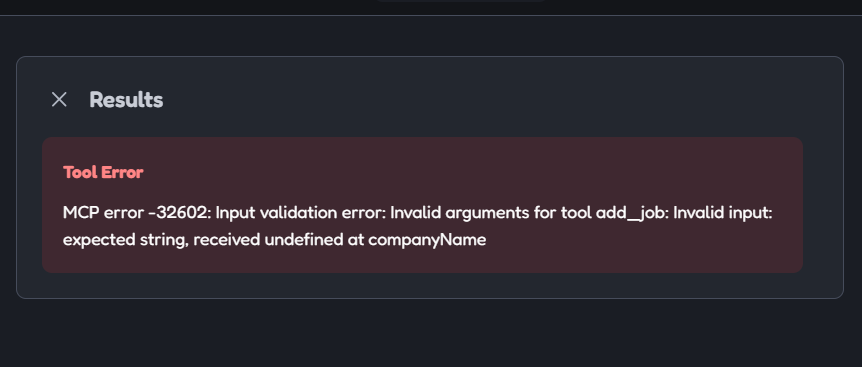
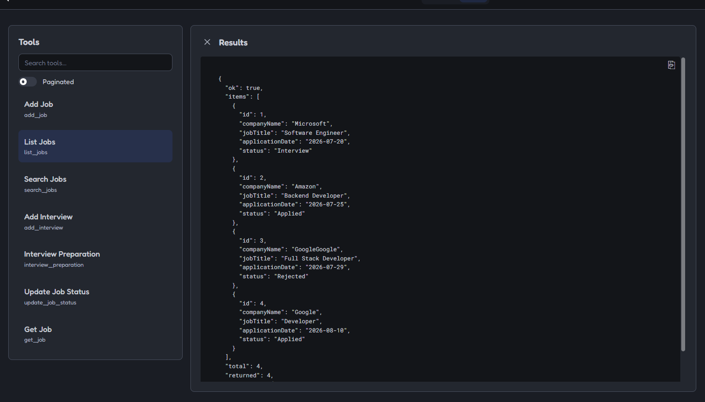
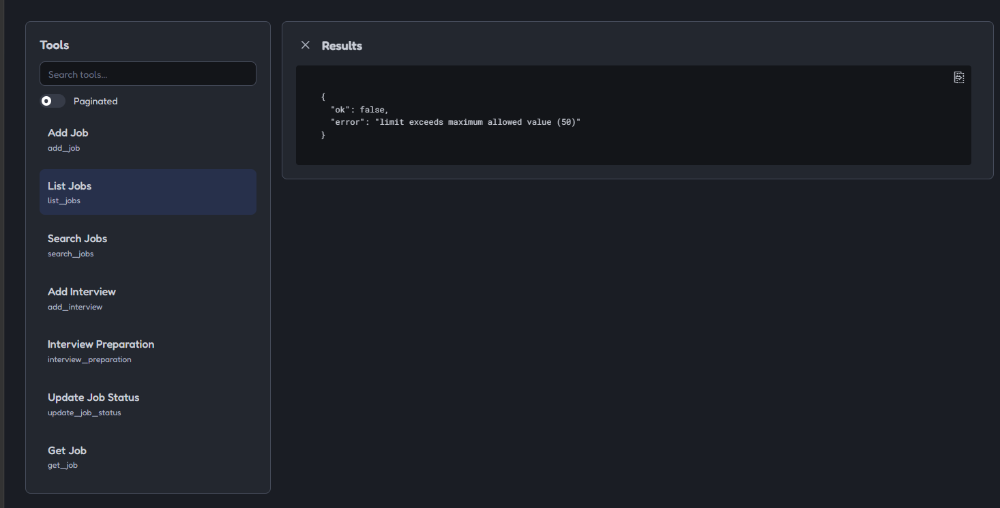
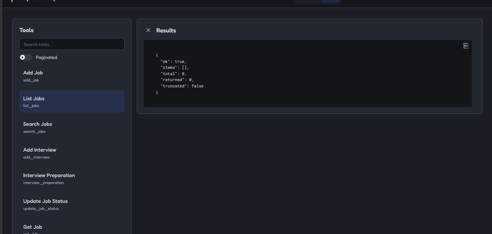
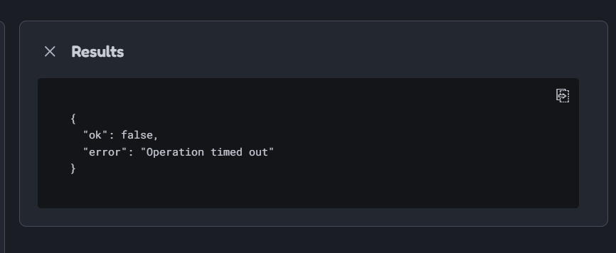

Manual Test Plan – Job Application Tracker MCP
| id | tool | setup | input | expected | result | evidence |

| TC-01 | add_job | jobs.json reset to empty state | Valid job object from examples/add-job.json | Job is created successfully and saved with new id | PASS | |
| TC-02 | add_job | Server running normally | Empty companyName or missing required field | Request rejected by Zod validation |PASS| |
| TC-03 | list_jobs | jobs.json contains saved jobs | { "limit": 10 } | Returns saved jobs with correct format |PASS| |
| TC-04 | list_jobs | jobs.json contains many records | { "limit": 100000 } | Request rejected because limit exceeds maximum allowed value |PASS| |
| TC-05 | list_jobs | jobs.json is empty | {} | Returns empty jobs list without error |PASS| |
| TC-06 | update_job_status | Job with id 1 exists | { "id":1, "status":"Interview" } | Status updated successfully |PASS||
| TC-07 | File operation timeout | Simulated slow filesystem | Trigger delayed file read/write | Server returns timeout error instead of hanging |PASS| |